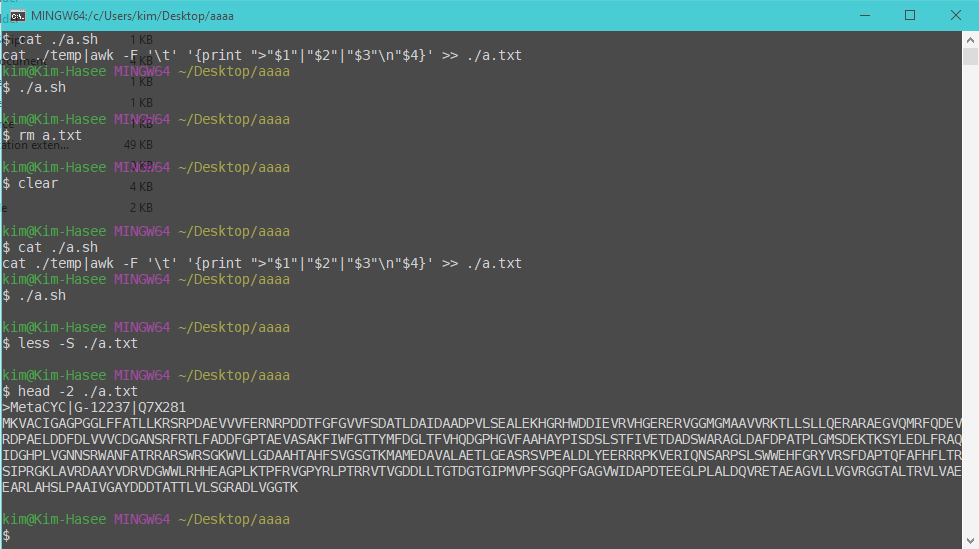

# 单行数据转fa
> 虽然已经慢慢淡出生信领域，慢慢渗透到IT, 看到洲更和阿秭发这种让人手痒的问题， 就忍不住在写完一堆自己都想吐的逻辑实现后抓住这个小问题练习一下，避免手生， 也算是给摸了这么长时间的鱼一点安慰吧。
## 可能是最简单的方式
这是非常适合萌新上手的练习，如果你还没有linux也没关系， git for windows提供了 常用的 gnu 工具包括``` sed awk grep``` 三剑客
```
cat ./temp|awk -F '\t' '{print ">"$1"|"$2"|"$3"\n"$4}' >> ./a.txt
```
效果如下


## Python的方式
```python
with open("./temp","r") as fi, open("./b.txt","w") as fo:
    for line in fi:
        tmp = line.split("\t")
        print(">"+'|'.join(tmp[:3])+"\n"+tmp[3],file=fo)
```
## Python进阶训练
除了常见单行序列的fa, 折行序列的fa有时也会出现，那我们如何生成折行的 fa呢？以 100nt 为例：
```python
with open("./temp","r") as fi, open("./c.txt","w") as fo:
    for line in fi:
        tmp = line.split("\t")
        print(">"+'|'.join(tmp[:3]),file=fo)
        for i in range(len(tmp[3])//100):
            print(tmp[3][i*100:(i+1)*100],file=fo)
        print(tmp[3][(len(tmp[3])//100)*100:],file=fo)
```
## 在 Python 中引用Ｃ
c 代码
```c
#include <stdio.h>
#include <stdlib.h>
#include <string.h>

typedef struct {
    char name[256];
    char nick1[256];
    char nick2[256];
    char seq[2048];
} fasta;

char fmtfa(char *iname,char *oname){
    FILE *fi;
    FILE *fo;
    char line[4096]; 
    char *arr;
    fi = fopen(iname,"r");
    fo = fopen(oname,"a");
    if (fi==NULL | fo== NULL){
        return 1;
    }
    fasta *fa = (fasta  *)malloc(sizeof(fasta));
    while(fgets(line, sizeof(line), fi)!= NULL)
	{
        sscanf(line,"%[^\t]\t%[^\t]\t%[^\t]\t%[^\t]\t",fa->name,fa->nick1,fa->nick2,fa->seq);
		fprintf(fo,">%s|%s|%s\n%s\n",fa->name,fa->nick1,fa->nick2,fa->seq);
	}
	fclose(fi);
    fclose(fo);
};
int main(){
    fmtfa("./temp","./d.txt");
}

```
将c编译成动态库
```bash
gcc ./mylib.c -shared -o mylib.dll
```
在python 中调用生成库
```python
from ctypes import *
mylib = cdll.LoadLibrary("./mylib.dll")
mylib.fmtfa(create_string_buffer(b"./temp"),create_string_buffer(b"./d.txt"))
```

好啦，今天就分享到这里啦,代码已经上传到生信媛的 github:https://github.com/biosxy/share, 欢迎大家 watch,star,fork,contrib.

